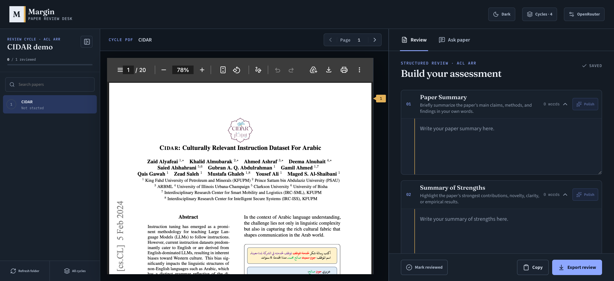
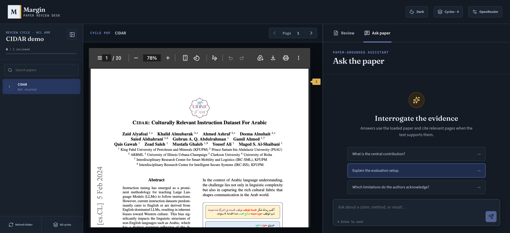

# Margin

> [!CAUTION]
> $\textcolor{red}{\textsf{Margin is not a replacement for reviewers — it only assists them. You must write the review yourself.}}$

Margin is a browser-based workspace for reviewing research papers. Open a folder of PDFs, move through a review cycle, write structured feedback, and ask questions grounded in each paper.

## Snapshot

### Review workspace



### Ask the paper



## Features

- Organize top-level PDFs into named review cycles
- Read papers alongside structured review fields
- Save review drafts and progress in the browser
- Export or copy completed reviews
- Ask questions with page-cited answers grounded in the paper
- Polish review prose with an OpenRouter model and review the proposed diff
- Store review cycles, drafts, progress, and extracted text in the browser

## Supported venues

Each review cycle uses venue-specific review fields. Margin currently supports:

<p align="center">
  &nbsp;&nbsp;&nbsp;&nbsp;
  &nbsp;&nbsp;&nbsp;&nbsp;
  &nbsp;&nbsp;&nbsp;&nbsp;
</p>
<p align="center">
  &nbsp;&nbsp;&nbsp;&nbsp;
  &nbsp;&nbsp;&nbsp;&nbsp;
  
  
</p>
<p align="center">
  &nbsp;&nbsp;&nbsp;&nbsp;
  &nbsp;&nbsp;&nbsp;&nbsp;
  
</p>
<p align="center">
  <!--  -->
</p>

Conference names and marks belong to their respective organizations. Their inclusion does not imply affiliation or endorsement.

## Requirements

- Node.js 20 or newer
- npm
- A modern browser; Chromium-based browsers provide the best folder-access experience
- An OpenRouter key entered in the app for Ask paper and review polishing

## Getting started

Install dependencies:

```bash
npm install
```

Start the development server:

```bash
npm run dev
```

Then open [http://localhost:3000](http://localhost:3000).

## Using Margin

1. Create a review cycle, choose its review venue, and select a folder containing PDFs. Subfolders are ignored.
2. Select a paper and complete the venue-specific review fields.
3. Optionally connect OpenRouter to polish review text or choose an OpenRouter model for paper chat.
4. Mark papers as reviewed and export or copy the finished review.

PDF uploads are limited to 30 MB. Extracted text used for chat is limited to 100,000 characters.

## Privacy

Review cycles, drafts, progress, and extracted paper text are stored in browser storage. PDFs are read from the selected folder and sent to the app's extraction route for processing, but are not persisted there. When an AI feature is used, the relevant paper or review text is sent to the configured model provider. Ask Paper requests enforce OpenRouter Zero Data Retention (ZDR), so a selected model will be unavailable if it has no ZDR-compatible provider endpoint.

OpenRouter keys entered in the interface are kept in session storage and sent only to this app's API routes for provider requests.

## Scripts

```bash
npm run dev    # Start the development server
npm run build  # Create a production build
npm run start  # Run the production server
npm run lint   # Run ESLint
```
